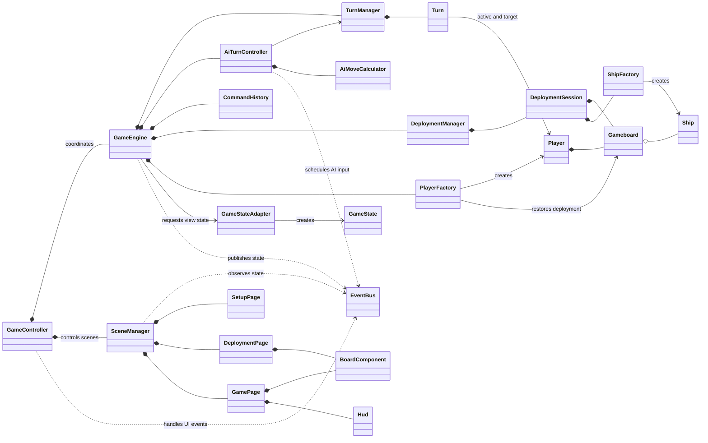
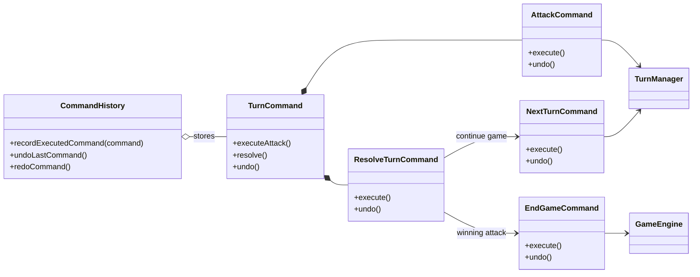

# Battleship JS

A browser-based Battleship game built in vanilla JavaScript as part of [The Odin Project](https://www.theodinproject.com/).

This project began as an exercise in JavaScript fundamentals, testing, and object-oriented programming. Over several months, it grew into an architecture experiment: I deliberately implemented patterns and separations that a game of this size does not strictly need so I could learn how they work in practice.

## Why is it so complex?

Battleship could comfortably be built with far fewer files and abstractions. The additional structure here is intentional.

I wanted to explore techniques that become useful in larger applications, including:

- Separating the game domain from the browser UI
- Breaking the interface into reusable, self-contained components
- Colocating component JavaScript, HTML, and CSS
- Using controllers to coordinate application flow
- Applying the Command pattern to game actions and undo/redo behaviour
- Communicating between separate parts of the application through events
- Adapting internal game state into a UI-friendly representation
- Managing component setup, rendering, subscriptions, and teardown
- Testing the core game rules independently from the interface

This is not presented as the simplest or definitive production architecture for a Battleship game. It is a learning project and an architecture playground. Some abstractions proved useful; others introduced more coordination and state-management work than the application warranted. Understanding that trade-off was an important part of building it.

## Features

- Player-versus-computer Battleship
- Manual and random fleet deployment
- Horizontal and vertical ship placement
- Undo and redo controls
- Turn history and clear hit/miss feedback
- Pausable AI turns
- Restart and quit-game controls
- Responsive game and deployment layouts

## Architecture

The application is split broadly into two areas:

- `src/backend` contains the game entities, boards, turn handling, commands, deployment logic, AI behaviour, state, and controllers.
- `src/frontend` contains page and UI components, with each component keeping its JavaScript, HTML, and CSS together.

The project does not use a frontend framework. The component lifecycle, DOM updates, event subscriptions, state-to-view adaptation, and page transitions are implemented directly in vanilla JavaScript. In effect, this let me encounter many of the problems that frameworks such as React and Angular are designed to help solve.

### Original planning sketch

I created this rough class diagram near the beginning of the project to help turn the initial idea into a mental model. It is preserved here as a snapshot of where the architecture started, rather than as documentation of the finished code.


### Final implementation

The completed application grew well beyond that first sketch. This diagram shows the main classes and their relationships at the end of the project. It intentionally omits individual methods and minor utilities so the overall structure remains readable.



The turn history is implemented with a set of reversible commands:



## AI usage and authorship

The bulk of this project—including its original architecture, game logic, component structure, command implementation, AI behaviour, and initial interface—was designed and written by me during my Odin Project learning journey.

After returning to the project following several months away, I used AI assistance for a final pass so I could resolve the remaining bugs, tidy some difficult areas, improve test coverage, and refresh the UI rather than leave the project unfinished. The final AI-assisted work included bug fixes, code cleanup, gameplay-feedback improvements, and responsive CSS/layout adjustments.

I have kept that assistance explicit because it is part of the project's history. The project still reflects my original decisions, experimentation, rebuilds, and learning process; the AI pass was a cleanup and completion step, not the source of the underlying project.

## Running locally

You will need a current version of [Node.js](https://nodejs.org/) and npm.

```bash
git clone https://github.com/DanielCHodgson/Battleship-JS.git
cd Battleship-JS
npm install
npm start
```

Webpack will start the development server and open the game in your browser.

## Available commands

```bash
npm start       # Start the development server
npm test        # Run the Jest test suite
npm run lint    # Check the source with ESLint
npm run build   # Create a production build in dist/
```

## What I learned

The biggest lesson was not simply how to apply architectural patterns, but when their cost is justified. This project gave me practical experience with separation of concerns, state ownership, event-driven communication, command history, component lifecycles, and the maintenance burden created by too many coordinating layers.

That perspective is something I will carry into future framework-based projects: abstractions should make change easier, and patterns should solve a real problem rather than exist for their own sake.
